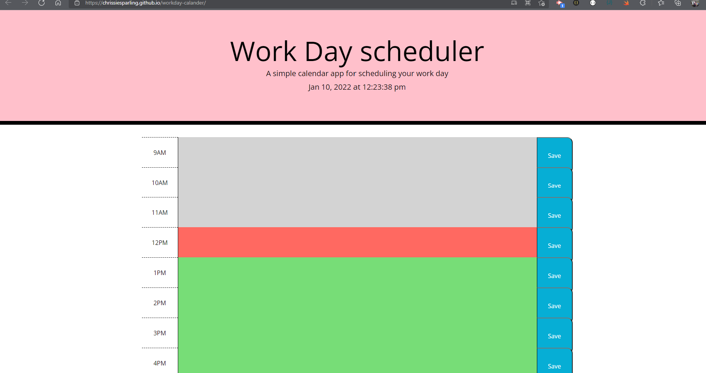

# workday-calander
created a time block in Java script.

display time when page loads

displays the current date and time

will change between light grey to salmon when current and past times...future time is green.

the information can be saved into the console

# snippet

# links to the deployed pages.
https://chrissiesparling.github.io/workday-calander/
https://github.com/ChrissieSparling/workday-calander

# Other material used:

https://stackpath.bootstrapcdn.com/bootstrap/4.3.1/css/bootstrap.min.css

https://fonts.googleapis.com/css?family=Open+Sans&display=swap

https://cdnjs.cloudflare.com/ajax/libs/jquery/3.2.1/jquery.min.js

https://cdnjs.cloudflare.com/ajax/libs/moment.js/2.24.0/moment.min.js

<!-- better Louis and Brett? hahahahaha -->